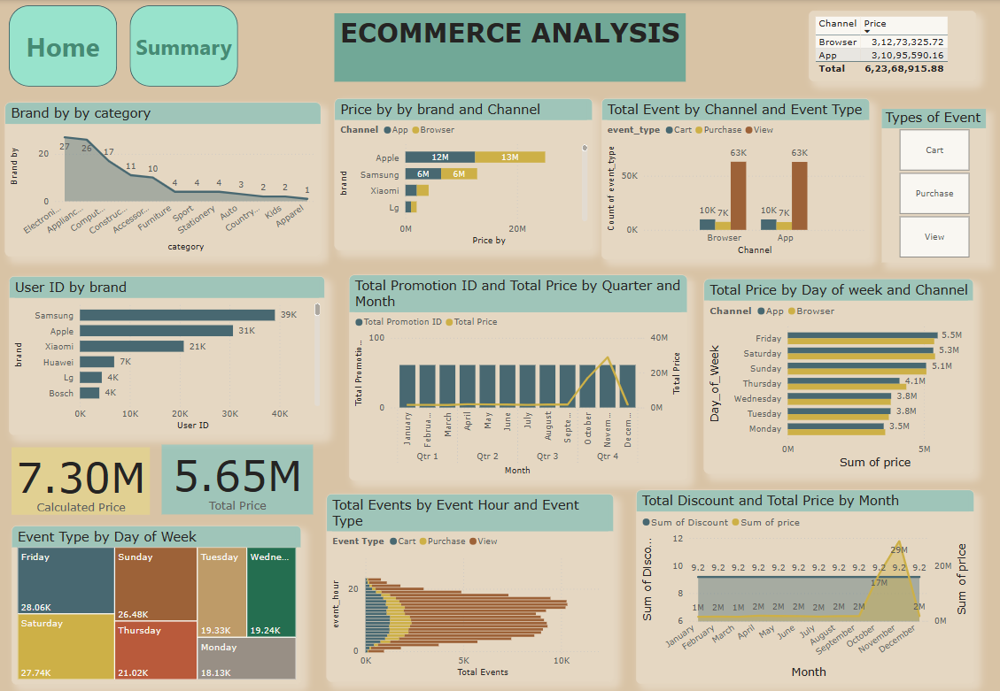

# E-Commerce Business Dashboard



## Overview

This Power BI dashboard provides insights into key performance metrics for an e-commerce business. It enables data-driven decision-making by visualizing sales trends, customer behavior, and operational performance.

## Features

- **Sales Performance:** Track revenue, order volume, and profit margins.
- **Customer Insights:** Analyze customer demographics, purchase patterns, and retention rates.
- **Product Analytics:** Identify top-selling products and inventory status.
- **Marketing Metrics:** Assess the effectiveness of campaigns and traffic sources.
- **Operational Efficiency:** Monitor order fulfillment times and return rates.

## Installation

To use this Power BI dashboard, ensure you have Power BI Desktop installed.

```bash
Download Power BI from https://powerbi.microsoft.com/
